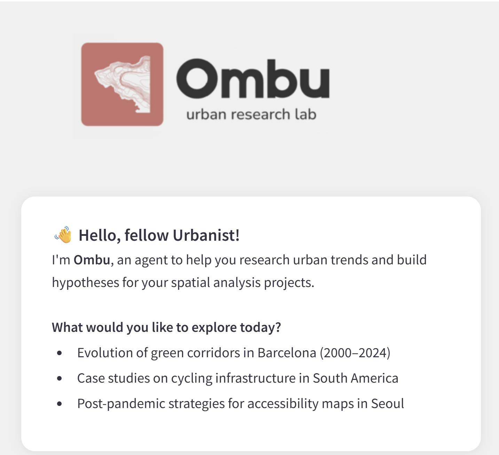
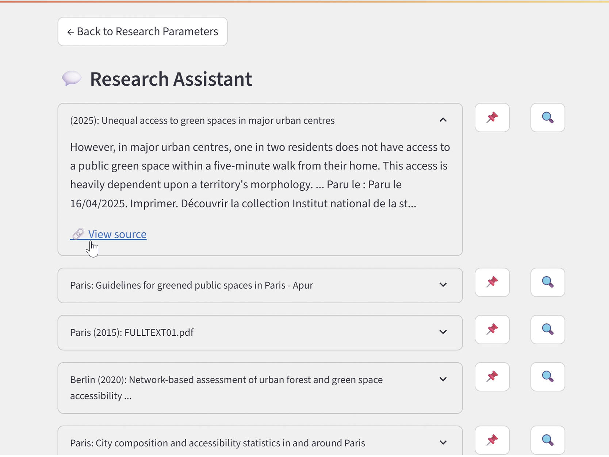
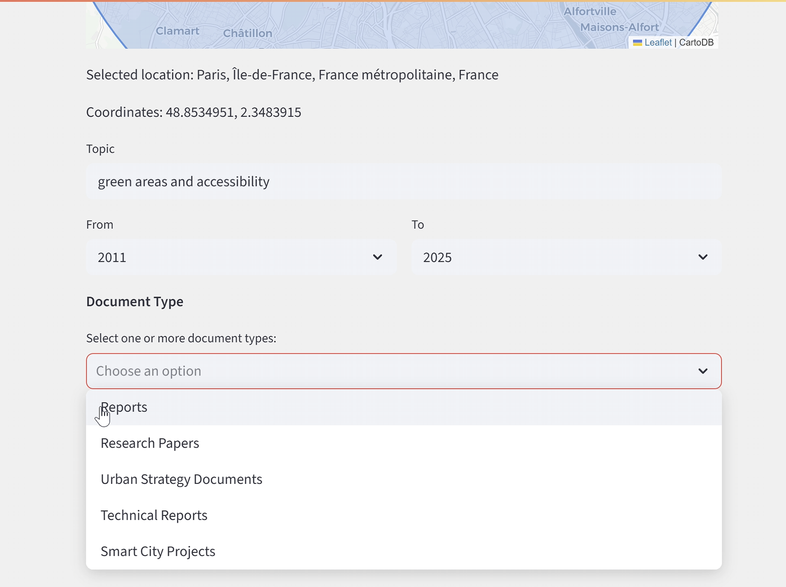
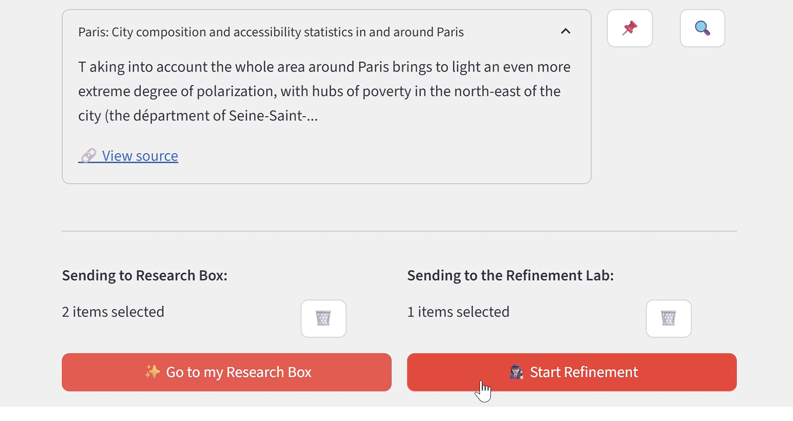
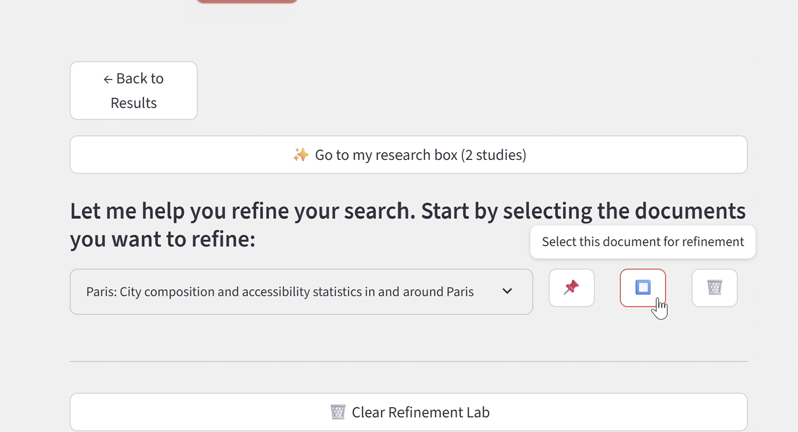
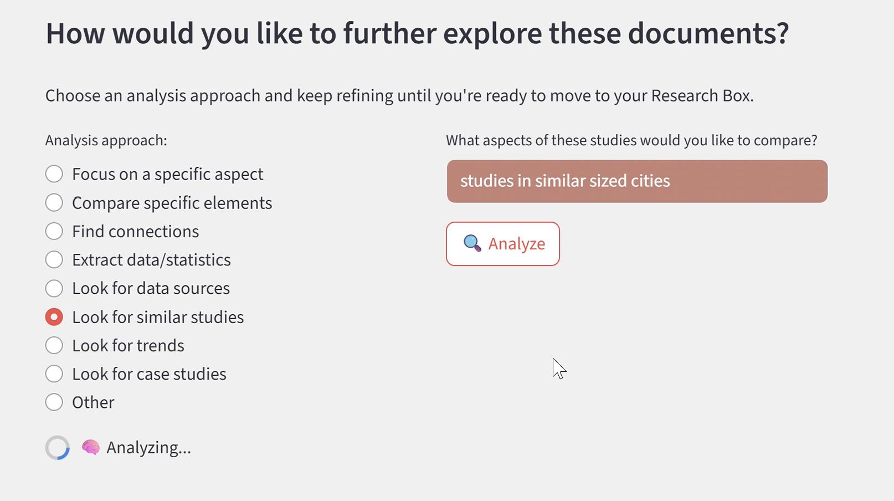
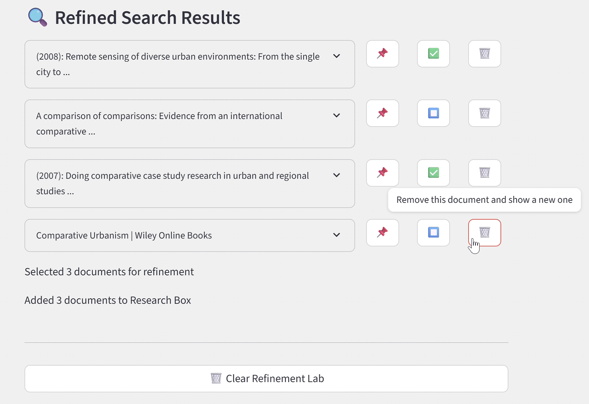
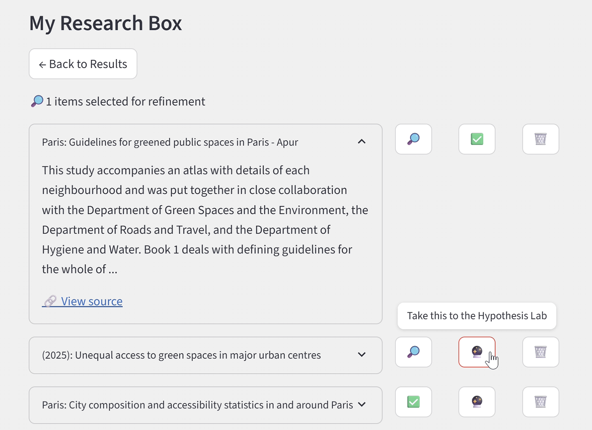
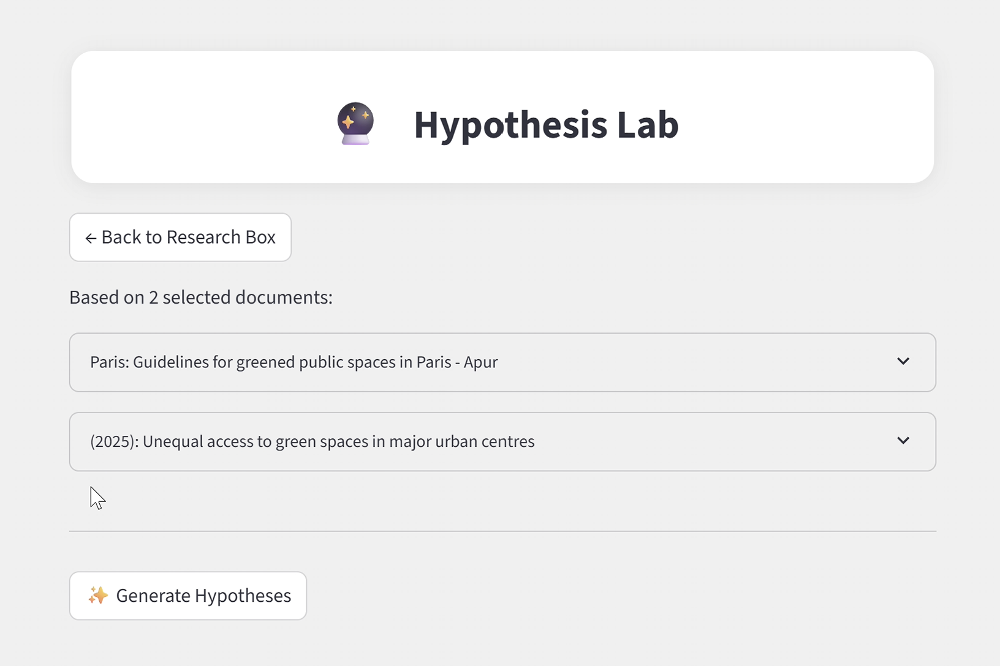
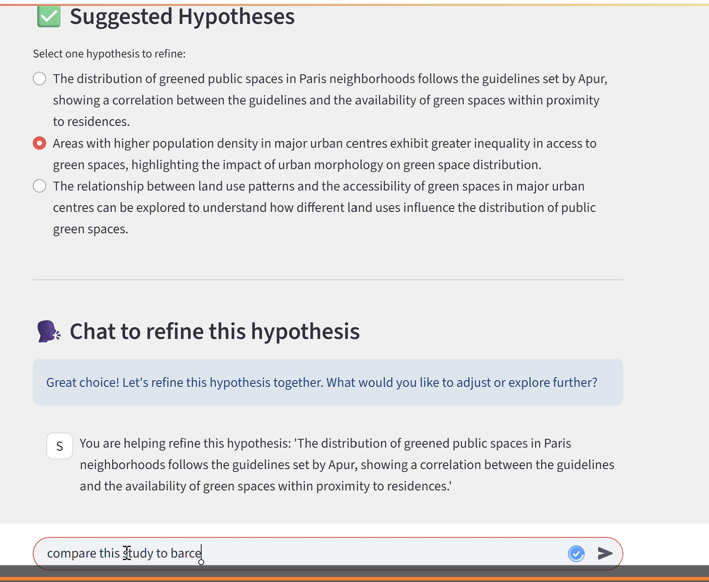

# Ombu Urban Lab 🏙️

Ombu Urban Lab is a research assistant designed to help urbanists find, organize, and refine documents related to spatial analysis. It allows you to search serious sources (reports, strategies, academic papers), extract summaries, and co-develop hypotheses for urban projects.

## 🔍 What It Does

- Search academic and professional documents about any urban topic
- Select documents for refinement or deeper analysis
- Organize key results into a personal Research Box
- Generate and refine spatial hypotheses with an AI agent

## 🛠️ Tech Stack

- Python
- Streamlit
- OpenAI API (`gpt-4o` or `gpt-4o-mini`)
- Geopy + Nominatim (for geolocation)
- Folium + Streamlit-Folium (for maps)
- dotenv (for local secrets)

## 🚀 Features

- 🌍 Define a city, topic, and timeframe for your research
- 🔍 Search government reports, journals, strategy docs & more
- 🧠 Summarize key documents using GPT
- 📦 Save, compare, and refine your Research Box
- 🔮 Co-create spatial hypotheses in the Hypothesis Lab
- 🧪 Start a dialog to iteratively improve your research question

## 📸 Interface Screenshots

  
  
  
  
  
  
  
  
  



## 🧠 Smart Search Architecture (Detailed)

This app uses a hybrid AI search workflow to retrieve and summarize relevant urban planning documents. The core logic combines **LLM summarization** with **semantic search** powered by third-party tools.

<<<<<<< HEAD

### 🔎 1. Tavily API — AI-powered Web Search  
[Tavily](https://www.tavily.com/) is an intelligent search API optimized for LLMs. It's used to retrieve high-quality, up-to-date sources (e.g., government reports, journal articles, policy briefs) based on the user's research prompt.
=======

**Why Tavily?**
- Returns focused results ideal for summarization  
- Filters out noisy or irrelevant websites  
- Enables fast and dynamic retrieval (no need to build a crawler)  

### 🧠 2. Pinecone — Vector Memory (Experimental)  
[Pinecone](https://www.pinecone.io/) is a vector database used to store and retrieve semantically embedded documents. In future versions of this app, Pinecone will be used to:

- Cache past research results for instant retrieval  
- Support **RAG (Retrieval-Augmented Generation)** for context-aware responses  
- Store spatial documents as vector embeddings for fuzzy matching  

You can initialize a Pinecone index with OpenAI embeddings to store summaries or full articles and query them using user prompts.

---

### 🗂 How These Integrate in the App

| Component            | Tool Used    | Description                                                                 |
|---------------------|--------------|-----------------------------------------------------------------------------|
| Search Query         | Tavily API   | Sends user-defined topic, location, and timeframe as prompt to Tavily      |
| Summarization        | OpenAI GPT   | Cleans and condenses Tavily responses into 3-bullet summaries               |
| Semantic Indexing    | Pinecone     | (Optional/Future) Embeds results for reuse, relevance ranking, and RAG     |
| Prompt Construction  | Custom Agent | Builds smart prompts for refinement, trend analysis, or hypothesis creation|

---

## 🛠 How to Run Locally

1. **Clone the repository:**

```bash
git clone https://github.com/your-username/project-ombu-urban-lab.git
cd project-ombu-urban-lab
```

2. **Create a virtual environment (optional):**

```bash
conda create -n my-environment python=3.10
conda activate my-environment
```

3. **Install dependencies:**

```bash
pip install -r requirements.txt
```

4. **Create your `.env` file with API keys:**

```env
OPENAI_API_KEY=your_openai_key
TAVILY_API_KEY=your_tavily_key
PINECONE_API_KEY=your_pinecone_key
PINECONE_ENVIRONMENT=your_pinecone_env
PINECONE_INDEX=your_index_name
```

5. **Run the app:**

```bash
streamlit run app.py
```

---

## 🧭 Next Steps

- [ ] Add Pinecone support to cache and re-query past results
- [ ] Introduce multi-source RAG to merge Tavily + Pinecone
- [ ] Add PDF/CSV upload to allow user datasets
- [ ] Improve UI consistency (fonts, spacing, emoji usage)
- [ ] Support map-based filtering and search

---


<<<<<<< HEAD
## 🎥 Demo Video

[▶️ Watch the demo here](https://drive.google.com/file/d/1xy9AIq5Cr4s15NA7M4F2OSuEnYsLjO5R/view?usp=drive_link)

====

## 🧠 Author

Made with ❤️ by a spatial data analyst obsessed with clarity, cities, and clean research workflows.

Manoela Calabresi | Urban Planner | Spatial Analyst
📧 manoela.calabresi@gmail.com 
https://www.linkedin.com/in/manoela-calabresi/


